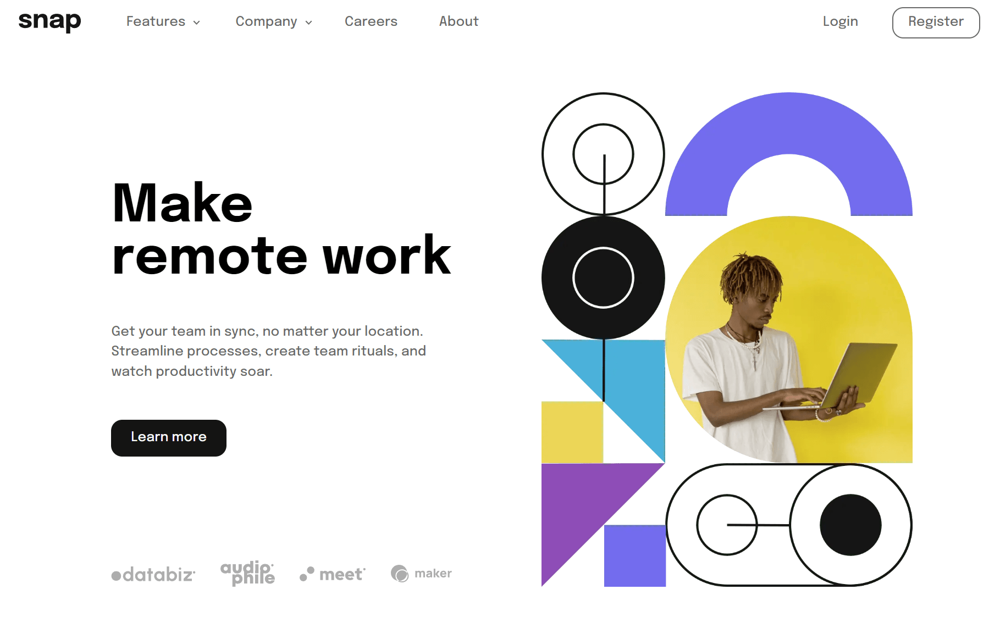

# Frontend Mentor - Intro section with dropdown navigation

This is a solution to the [intro section with dropdown navigation challenge on Frontend Mentor](https://www.frontendmentor.io/challenges/intro-section-with-dropdown-navigation-ryaPetHE5). Frontend Mentor challenges help you improve your coding skills by building realistic projects.

**Difficulty**: `junior`

**Deployment status** 

## Table of contents

- [Frontend Mentor - Intro section with dropdown navigation](#frontend-mentor---intro-section-with-dropdown-navigation)
  - [Table of contents](#table-of-contents)
  - [Overview](#overview)
    - [The challenge](#the-challenge)
    - [Links](#links)
  - [My process](#my-process)
    - [Built with](#built-with)
    - [What I learned](#what-i-learned)
    - [Continued development](#continued-development)
    - [Useful resources](#useful-resources)
  - [Project information](#project-information)
    - [User stories and features](#user-stories-and-features)
  - [Author](#author)

## Overview

### The challenge

To build the intro section with dropdown navigation according to the given designs as close as possible.
The users should be able to:

- View the relevant dropdown menus on desktop and mobile when interacting with the navigation links
- View the optimal layout for the content depending on their device's screen size
- See hover states for all interactive elements on the page

### Links

- Solution URL: [Open GitHub repository](https://github.com/YariMorcus/intro-section-with-dropdown-navigation)
- Live Site URL: [open Netlify page](https://intro-section-yari-morcus.netlify.app)

## My process

### Built with

- Semantic HTML5 markup
- CSS _(BEM naming convention used, [see getbem.com](http://getbem.com) for more information)_
- Flexbox
- CSS Grid
- ES6 classes
- Mobile-first workflow
- Optimized for both Open Graph (Facebook) and Twitter Cards
- [Node.js](https://nextjs.org) - Open source and multi platform JavaScript runtime environment
- [NPM](https://www.npmjs.com) - Package Manager for Node JavaScript platform
- [Browsersync](https://browsersync.io) - Synchronous browser testing (in collaboration with Gulp)
- [Parcel](https://parceljs.org) - Zero configuration build tool / module bundler to automate workflow
- [Sass](https://sass-lang.com) - CSS Preprocessor (in collaboration with Parcel)
- [GitHub](https://github.com) - Technological platform based on Git
- [Git](https://git-scm.com) - Free and open source distributed version control system
- [Netlify](https://www.netlify.com) - Free service to host static webpages and web applications

### What I learned

1. Always use semantic compliant-standard HTML
2. To keep testing the application for Web Accessibility
3. To spend time looking at the details of the designs to create the application as accurately as possible
4. How to work with ES6 classes
5. How to work with a zero configuration build tool such as Parcel
6. How to write documentation for functions
7. How to implement progressive enhancement in relation to a navigation
8. How to deliver JavaScript-enhanced content if applicable for the user (how to create a dropdown menu with JS)

### Continued development

The way I want to continue to develop myself is by focusing on laying out a proper foundation of HTML, CSS, and JavaScript.
This so I can build quality websites for clients by just using the core languages of the Web.
At the present, I am working on the above things by going through (interactive) articles on the MDN Web Docs (see chapter [Useful resources](#useful-resources)).

Another way I want to improve my knowledge of these subjects is to do more challenges that [Frontend Mentor](https://www.frontendmentor.io/challenges) is offering, starting at the lowest level, and building that up to the more advanced ones.

Besides the above, I want to continue to develop myself by using several tools more often to improve my workflow. and spend less time doing things that can be automated.

A few tools that I will start using more often are:

1. Gulp
2. Parcel
3. Git
4. GitHub
5. Netlify (in combination with Continues Deployment)

_I will learn the above points in between but do not want to focus too much on those at the moment._

As soon as I am capable of creating quality websites with the core languages of the Web, I will start to learn JavaScript libraries and frameworks. Both of these change over time, so I do not want to spend my time on those before I have a solid understanding of prior mentioned languages.

### Useful resources

- [Transfonter](https://transfonter.org) - Has been used to convert the downloaded font files to WOFF and WOFF2 (most recent font formats, supported in all major browsers), and generate the corresponding `@font-face` CSS rulesets
- [Frontend Mentor - Intro section with dropdown navigation challenge on Frontend Mentor](https://www.frontendmentor.io/challenges/intro-section-with-dropdown-navigation-ryaPetHE5)

## Project information

### User stories and features

**US.1**: as a user, I want to be able to view the menu items in the drop-down menu as soon as I click on a menu item. This is so I can navigate to the necessary page without being overwhelmed by the amount of menu items.

## Author

- LinkedIn - [Yari Morcus](https://www.linkedin.com/in/yarimorcus) _(must be logged in)_
- Frontend Mentor - [@YariMorcus](https://www.frontendmentor.io/profile/YariMorcus)
